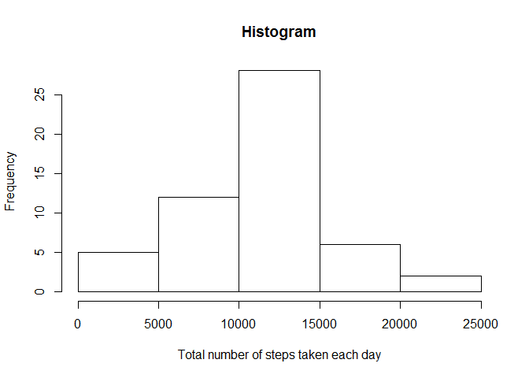
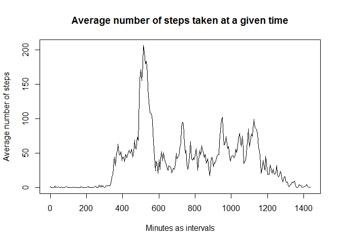
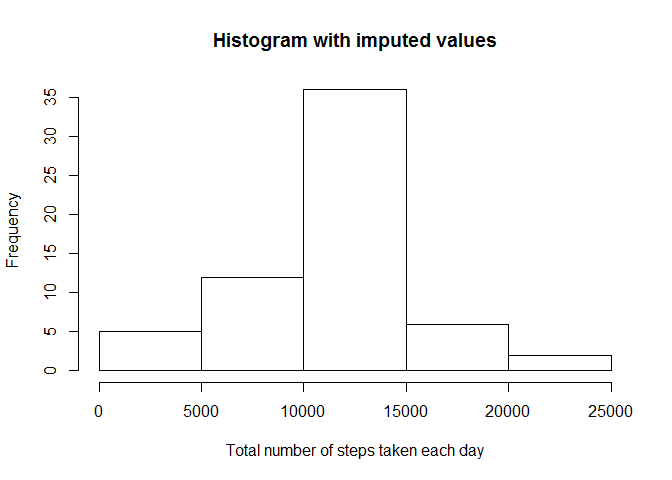
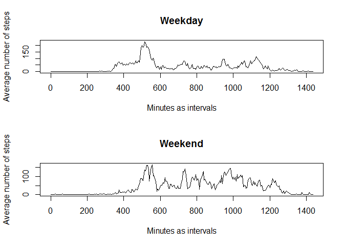

# Reproducible Research: Peer Assessment 1


## Loading and preprocessing the data
Description:  

> Show any code that is needed to  
>     1. Load the data (i.e. read.csv())  
>     2. Process/transform the data (if necessary) into a format suitable for your analysis  
> 
  
* Set the working directory and read in the csv-file (with header, comma-separated).  

```r
data <- read.csv(unzip("activity.zip"), header=T, sep=",")
```

* Take a look at the data.

```r
head(data)
```

```
##   steps       date interval
## 1    NA 2012-10-01        0
## 2    NA 2012-10-01        5
## 3    NA 2012-10-01       10
## 4    NA 2012-10-01       15
## 5    NA 2012-10-01       20
## 6    NA 2012-10-01       25
```

```r
str(data)
```

```
## 'data.frame':	17568 obs. of  3 variables:
##  $ steps   : int  NA NA NA NA NA NA NA NA NA NA ...
##  $ date    : Factor w/ 61 levels "2012-10-01","2012-10-02",..: 1 1 1 1 1 1 1 1 1 1 ...
##  $ interval: int  0 5 10 15 20 25 30 35 40 45 ...
```

## What is mean total number of steps taken per day?
Description:  

> For this part of the assignment, you can ignore the missing values in the dataset.  
>     1. Make a histogram of the total number of steps taken each day  
>     2. Calculate and report the mean and median total number of steps taken per day  
> 

* First, create a function that would make a data frame out of given data specifying only the dates and total steps taken that day. This can be used later with imputed values as well.  
* Ignore all the observations that have ``NA``'s as the values for ``steps`` by leaving them out when subsetting complete cases from the observations per each date. When one would simply ``sum`` the steps later with argument ``na.rm=TRUE``, then that would give zeros instead of ``NA``'s, which would rather be imputing the missing values.

```r
totalsteps <- function(dat, complete=T){
      stepsperday <- data.frame()
      for (level in levels(dat$date)){
            onedate_data <- droplevels(subset(dat, date==level))
            if (complete) {
                  onedate_datac <- onedate_data[complete.cases(onedate_data),]
                  onedate_data <- onedate_datac
            }
            if (nrow(onedate_data) > 0) {
                  onedate_total <- sum(onedate_data$steps)
                  onedate <- data.frame(unique(onedate_data$date), onedate_total)
                  stepsperday <- rbind(stepsperday, onedate)
            }
      }
      names(stepsperday) <- c("date", "total")
      return(stepsperday)
}
```

* Take a look at the new data frame and then make a histogram of total number of steps taken each day.

```r
total_steps <- totalsteps(data, complete=T)
head(total_steps)
```

```
##         date total
## 1 2012-10-02   126
## 2 2012-10-03 11352
## 3 2012-10-04 12116
## 4 2012-10-05 13294
## 5 2012-10-06 15420
## 6 2012-10-07 11015
```

```r
hist(total_steps$total, xlab="Total number of steps taken each day", main="Histogram")
```

 

* Calculate the mean and median for total steps taken each day.

```r
mean(total_steps$total)
```

```
## [1] 10766.19
```

```r
median(total_steps$total)
```

```
## [1] 10765
```

## What is the average daily activity pattern?
Description:  

>     1. Make a time series plot (i.e. type = "l") of the 5-minute interval (x-axis) and the average number of steps taken, averaged across all days (y-axis)  
>     2. Which 5-minute interval, on average across all the days in the dataset, contains the maximum number of steps?  
> 

* Write a function that takes the following arguments:  
      - dat (data frame)
      - minutes (should the intervals be converted into minutes to have equidistant intervals (instead of 45 minutes from 1:00 to 1:45 and the 5 minutes from 1:55 to 2:00 being counted as the same amounts of time), since it was not specified, whether the 5-minute intervals have to follow POSIXct)
      - complete (should the missing values in the data set be counted as zeros (``=FALSE``) or be omitted (``=TRUE``))
      - rounding (should the averages be rounded (``=TRUE``) or not (``=FALSE``))  


```r
averageperinterval <- function(dat, minutes=T, complete=T, rounded=F) {
      stepsperinterval <- data.frame()
      for (inter in unique(dat$interval)) {
            oneinterval_data <- droplevels(subset(dat, interval==inter))
            if (complete) {
                  oneinterval_datac <- oneinterval_data[complete.cases(oneinterval_data),]
                  oneinterval_data <- oneinterval_datac
            }
            oneinterval_total <- sum(oneinterval_data$steps, na.rm=T)
            oneinterval_average <- oneinterval_total/nrow(oneinterval_data)
            if (rounded) {
                  oneinterval_averagernd <- round(oneinterval_average)
                  oneinterval_average <- oneinterval_averagernd
            }
            if (minutes) {
                  if (inter >= 100) {
                        interval <- inter-(40*(inter%/%100))
                  }
                  else {
                        interval <- inter
                  }
            }
            else {
            interval <- inter
            }
            oneinterval <- data.frame(interval, oneinterval_average)
            stepsperinterval <- rbind(stepsperinterval, oneinterval)
      }
      names(stepsperinterval) <- c("interval", "steps_average")
      return(stepsperinterval)
}
```

* Make a time series plot for average number of steps taken per interval (in minutes), averaged across all days. The plot only shows the averages not counting the NA's.

```r
average_per_minutes <- averageperinterval(data)
plot(average_per_minutes$interval, average_per_minutes$steps_average, type="l", xlab="Minutes as intervals", ylab="Average number of steps", main="Average number of steps taken at a given time")
```

 

* The plot shows maximum average activity around 500 seconds, that is around 8:30AM. To find out, what is the exact time interval for the maximum number of steps taken on average, find the maximum with the function ``max()`` and subset the row with the maximum as the value for ``steps_average``.

```r
average_per_interval <- averageperinterval(data, minutes=F)
maxsteps <- max(average_per_interval$steps_average)
average_per_interval[average_per_interval$steps_average==maxsteps,]
```

```
##     interval steps_average
## 104      835      206.1698
```

* The maximum steps taken on average is at 8:35AM.

## Imputing missing values
Description:  

> Note that there are a number of days/intervals where there are missing values (coded as NA). The presence of missing days may introduce bias into some calculations or summaries of the data.  
>     1. Calculate and report the total number of missing values in the dataset (i.e. the total number of rows with NAs)  
>     2. Devise a strategy for filling in all of the missing values in the dataset. The strategy does not need to be sophisticated. For example, you could use the mean/median for that day, or the mean for that 5-minute interval, etc.  
>     3. Create a new dataset that is equal to the original dataset but with the missing data filled in.  
>     4. Make a histogram of the total number of steps taken each day and Calculate and report the mean and median total number of steps taken per day. Do these values differ from the estimates from the first part of the assignment? What is the impact of imputing missing data on the estimates of the total daily number of steps?  
> 

* Find rows that have missing values in them by counting the number of rows that have the value ``TRUE`` for ``is.na``.

```r
missing_values <- is.na(data$steps)
nrow(data[missing_values,])
```

```
## [1] 2304
```

* The most suitable would seem to replace the missing values with the rounded number of average steps taken per interval (not counting the NA's as zeros). Rounding for replacement seems reasonable, since it is very unlikely to take anything else but full steps... 
* Just to check, print on the first rows of the data frame.

```r
head(averageperinterval(data, minutes=F, rounded=T))
```

```
##   interval steps_average
## 1        0             2
## 2        5             0
## 3       10             0
## 4       15             0
## 5       20             0
## 6       25             2
```

* Merge the original data frame and the rounded averages data frame into a new data frame ``data2``. This changes the order of the columns in the new data frame (interval, steps, date, steps_average), but that doesn't really matter.  
* Then create another new data frame from ``data2`` called ``data3`` and add a new column ``Steps`` that contains the same information that the column ``steps``.  
* Then, in the new data frame (``data3``), replace the values of ``steps`` in the rows that contain missing values with the values of ``steps_average`` in the same rows.
* Finally, subset only the columns 5, 3 and 1 (``Steps``, ``date`` and ``interval``, respectively) and create a final data frame ``data_imputed``. Change the name of the first column to ``steps``.

```r
data2 <- merge(data, averageperinterval(data, minutes=F, rounded=T), by="interval")
data3 <- data2
data3$Steps <- data3$steps
data3_missing <- is.na(data3$steps)
data3$Steps[data3_missing] <- data3$steps_average[data3_missing]
data_imputed <- data3[,c(5,3,1)]
colnames(data_imputed)[1] <- "steps"
```

* Create a new dataset with the imputed values with the function ``totalsteps()`` defined earlier.

```r
steps_imputed <- totalsteps(data_imputed, complete=F)
head(steps_imputed)
```

```
##         date total
## 1 2012-10-01 10762
## 2 2012-10-02   126
## 3 2012-10-03 11352
## 4 2012-10-04 12116
## 5 2012-10-05 13294
## 6 2012-10-06 15420
```

* As we can see, the steps that were all ``NA``'s and not computed with in the ``total_steps`` data frame before (for example for the date "2012-10-01"), have now gotten total values based on the averages per intervals across other dates in the dataset.  

* Make a histogram of the dataset with imputed values.

```r
hist(steps_imputed$total, xlab="Total number of steps taken each day", main="Histogram with imputed values")
```

 

* Get the mean and median for the total number of steps taken (with imputed values).

```r
mean(steps_imputed$total)
```

```
## [1] 10765.64
```

```r
median(steps_imputed$total)
```

```
## [1] 10762
```

* The median from the imputed data has gone down a bit compared to the median of the dataset with omitted ``NA``'s. The mean has slightly dropped as well, but there seem to be no big differences between the two analyses.  

## Are there differences in activity patterns between weekdays and weekends?
Description:  

> For this part the weekdays() function may be of some help here. Use the dataset with the filled-in missing values for this part.  
>     1. Create a new factor variable in the dataset with two levels – “weekday” and “weekend” indicating whether a given date is a weekday or weekend day.  
>     2. Make a panel plot containing a time series plot (i.e. type = "l") of the 5-minute interval (x-axis) and the average number of steps taken, averaged across all weekday days or weekend days (y-axis). See the README file in the GitHub repository to see an example of what this plot should look like using simulated data.  
> 

* Create a new data frame called ``data_times``, convert the ``date`` column into times. 
* Set the system to English with the function ``Sys.setlocale()``.
* Add another factor (column) called ``day`` using the function ``weekdays()``. 
* Check the levels of the factor ``day`` and change them into a binary opposition between weekdays and weekend days (so Monday, Tuesday, Wednesday, Thursday and Friday would correspond to weekdays and Saturday and Sunday to weekend days).   

```r
data_times <- data_imputed
data_times$date <- strptime(data_times$date, format="%Y-%m-%d")
Sys.setlocale("LC_TIME", "English")
```

```
## [1] "English_United States.1252"
```

```r
data_times$day <- factor(weekdays(data_times$date))
levels(data_times$day)
```

```
## [1] "Friday"    "Monday"    "Saturday"  "Sunday"    "Thursday"  "Tuesday"  
## [7] "Wednesday"
```

```r
levels(data_times$day) <- c("weekday", "weekday", "weekend", "weekend", "weekday", "weekday", "weekday")
```

* Subset the ``data_times`` into two separate data frames: one with weekdays in it and one with weekend days in it. Check if the sum of the number of rows in both datasets adds up to the number of rows in the ``data_times`` dataset.

```r
weekdays <- droplevels(subset(data_times, day=="weekday"))
weekend <- droplevels(subset(data_times, day=="weekend"))
nrow(data_times)==nrow(weekdays)+nrow(weekend)
```

```
## [1] TRUE
```

* Create two data frames for weekdays and weekend using the function ``averageperinterval()`` defined earlier.

```r
weekday_average <- averageperinterval(weekdays, complete=F)
weekend_average <- averageperinterval(weekend, complete=F)
```

* Finally make a panel plot of the average steps taken per interval for weekdays and weekend. I am using the base package, because I haven't learnt how to use ggplot yet, but I hope this gives the overall same results as would plots done with ggplot.

```r
par(mfrow=c(2,1))
plot(weekday_average$interval, weekday_average$steps_average, type="l", xlab="Minutes as intervals", ylab="Average number of steps", main="Weekday")
plot(weekend_average$interval, weekend_average$steps_average, type="l", xlab="Minutes as intervals", ylab="Average number of steps", main="Weekend")
```

 
